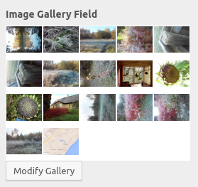

# Customize Image Gallery Control

Adds Customizer support for image gallery control type.

## Description ##
Adds new Customizer control type `image_gallery` by extending WP_Customize_Control class. Allows choosing multiple images from Media Library, saves the ID-s as an array.
Displays icons of the images in Customizer.

Requires PHP 5.3+

## Screenshots ##

